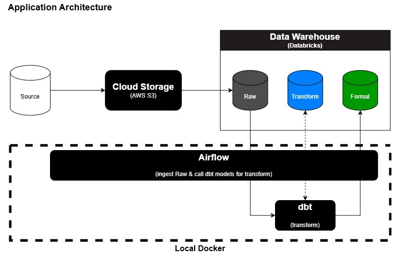
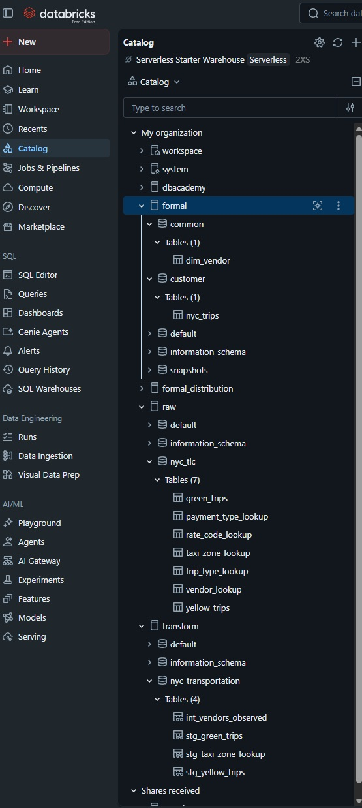
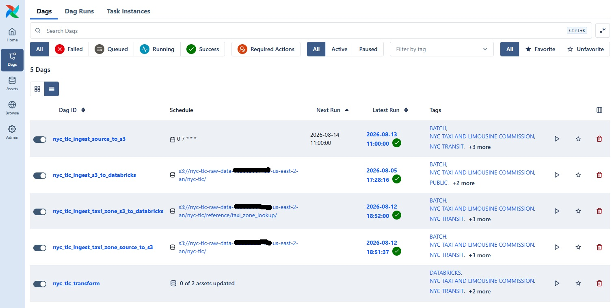
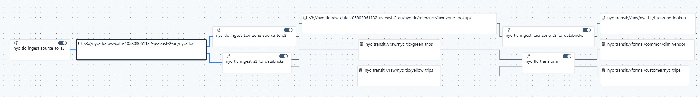
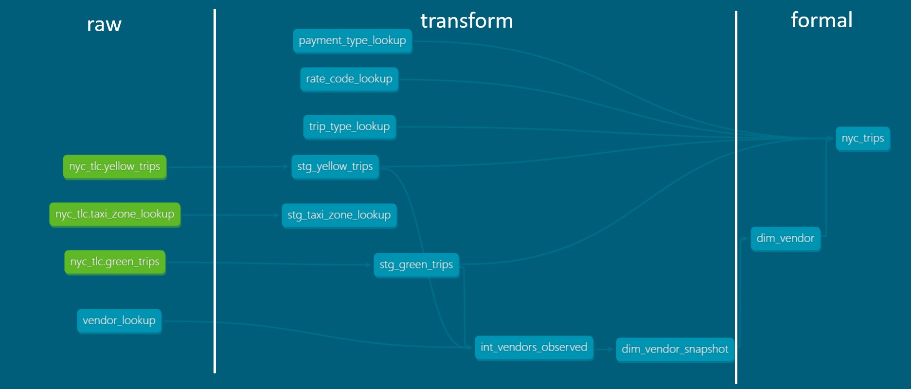
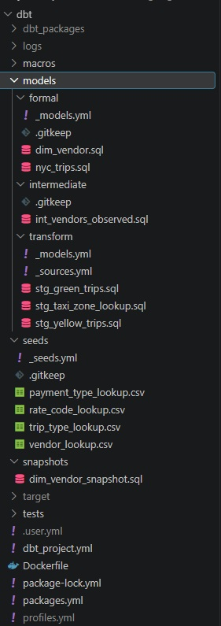

# Reference Architecture

A working reference architecture and boiler-plate for establishing conventions 
in design, naming, and infrastructure across an enterprise data program.

It pairs with the [Data & Analytics Governance
Standards](https://github.com/crichton24/Data-Analytics-Team-Standards)
repository, which provides the corresponding principles, quality norms, and
release control standards as a starting point for adaptation.

The implementation is deliberately end-to-end — ingestion, orchestration,
transformation, and governance. Every significant decision is recorded as
an [Architecture Decision Record](docs/decisions/), including the options
rejected and why.

## Disclaimers

**This is a living repository.** The baseline is refined continuously as
enterprise deployment, methodology, and tooling advance. Decisions recorded
here are largely superseded rather than rewritten, so the reasoning behind 
a change remains available.

**Security choices favor low-cost deployment.** The architecture design is 
rooted in prior enterprise deployments, but many implementation decisions here 
target Docker and free tiers — personal access tokens rather than service
principals, long-lived IAM keys rather than assumed roles, and simplified
authentication in the local stack. An enterprise deployment of the same
technologies requires different choices to achieve least-privilege access.
These constraints are documented in the relevant ADRs and in Known Gaps.

**AI**  Claude was utilized in writing code and documentation with heavy 
guidance and modification from myself.


---
# NYC Transportation Lakehouse

An end-to-end data platform built on public NYC transportation data. Batch
ingestion, a governed lakehouse, dimensional models with enforced contracts,
and event-driven orchestration throughout.

The design decisions are documented in [`docs/decisions/`](docs/decisions/) including
ADRs which describe what was considered and rejected.

## Architecture

### Application Architecture


---
### Detailed Architecture

```
NYC TLC trip records ──┐
  (monthly parquet)    │
                       ├─► Airflow ─► S3 ─► Databricks ─► dbt ─► formal
NYC TLC taxi zones ────┘   (poll)   (land)   (COPY INTO)  (models)  (marts)
  (reference CSV)
```

Every stage is chained by Airflow assets rather than a schedule. Only the
first DAG has a cron; everything downstream fires on data arrival. Since TLC
publishes roughly monthly, the chain is dormant most days by design.

```
nyc_tlc_ingest_source_to_s3                    daily 07:00 ET
    │  LANDING           (emitted only when files actually landed)
    ├────────────────────────────────┬────────────────────────────┐
    ▼                                ▼
nyc_tlc_ingest_s3_to_databricks     nyc_tlc_ingest_taxi_zone_source_to_s3
    │  RAW_YELLOW + RAW_GREEN         │  ZONE_LANDED  (only if CSV changed)
    ▼                                ▼
nyc_tlc_transform                    nyc_tlc_ingest_taxi_zone_s3_to_databricks
    │  FORMAL_*                       │  ZONE_LOOKUP
    ▼                                ▼
```

## Catalog structure

The primary layer is the **catalog**; the domain is the **schema**
(ADR [0009](docs/decisions/0009-medallion-catalogs-with-literal-schemas.md)).

| Layer | Objects | Contracted |
|---|---|---|
| `raw` | `nyc_tlc.yellow_trips`, `nyc_tlc.green_trips`, `nyc_tlc.taxi_zone_lookup` | No |
| `transform` | `nyc_transportation.stg_*` (views) | No |
| `formal` | `customer.nyc_trips`, `common.dim_vendor`, seeds | Yes |

`raw` is append-only and takes whatever the source sends. `transform` renames
and types. `formal` is the only layer consumers should query, and the only one
with enforced contracts and governance tags.

### Why not Medalion?
This design choice is specifically a variant of the popular "medallion" structure of bronze, silver,
and gold, which can be problematic for enterprise deployments. The downstream confusion and 
potential collision of governance between silver and gold often causes more problems than it solves.
Granting analysts access to raw and formal only allows for faster speed to market for (unsurprisngely) 
analysis and more stability in corporate reporting.  Data engineers work with analysts in parallel to 
build out the formal layer.

It also avoids "zombie" datasets in silver, which is often deprioritized for the next data demand.

## Repo layout

| Path | Contents |
|---|---|
| `airflow/dags/` | Five DAGs plus `assets.py` |
| `airflow/tests/` | DagBag integrity and house-rule tests |
| `dbt/models/` | transform, intermediate, formal |
| `dbt/snapshots/` | `dim_vendor_snapshot` (SCD2) |
| `dbt/seeds/` | Vendor, rate code, payment type, trip type lookups |
| `databricks/ddl/` | Catalog, schema, and external location setup |
| `infra/terraform/` | S3 and IAM (describes intent; not yet applied) |
| `docker/` | Local development stack |
| `docs/decisions/` | ADRs |

## Quickstart

```bash
cp .env.example .env          # fill in AWS and Databricks values
docker compose --env-file .env -f docker/docker-compose.yml up -d
```

Airflow UI at http://localhost:8080. Authentication is disabled locally via
`SIMPLE_AUTH_MANAGER_ALL_ADMINS`.

**Run every compose command with `--env-file .env`.** Compose looks for `.env`
beside the compose file, not at the repo root, and a missing one silently
expands variables to empty strings rather than erroring.

### First dbt build

Run once, by hand, before enabling `nyc_tlc_transform`. Step by step, so
contract and type mismatches surface one at a time:

```bash
D="docker compose --env-file .env -f docker/docker-compose.yml run --rm dbt"
$D deps
$D seed --full-refresh
$D run --select transform
$D run --select int_vendors_observed
$D snapshot                              # creates the SCD2 table
$D run --select dim_vendor
$D run --select nyc_trips --full-refresh
$D test
```

`--full-refresh` belongs on that first `nyc_trips` build only. It must not be
in the DAG.

### Lineage

```bash
$D docs generate
docker compose --env-file .env -f docker/docker-compose.yml \
  run --rm --service-ports dbt docs serve --port 8080 --host 0.0.0.0
```

At http://localhost:8081 — 8081 because Airflow owns 8080. `--service-ports`
is required or the mapping is ignored.

## Prerequisites

Three systems authenticate independently. Granting one grants nothing to the
others (ADR [0007](docs/decisions/0007-credential-patterns-by-environment.md)).

**AWS.** A bucket in the same region as the Databricks workspace (`us-east-2`).
An IAM user for Airflow scoped to `GetObject`, `PutObject`, `ListBucket` on
that bucket. A separate IAM role for Databricks to assume.

**Databricks.** A SQL warehouse. A Unity Catalog storage credential wrapping
the IAM role, an external location over the landing prefix, and a `READ FILES`
grant. Catalogs must exist before dbt runs — dbt creates schemas, not catalogs.
Run `databricks/ddl/` in numeric order.

**Airflow.** Nothing to configure in the UI. Connections come from
`AIRFLOW_CONN_*` environment variables (ADR
[0006](docs/decisions/0006-connections-as-environment-variables.md)).

---

## Images
### Databricks
Three primary catalogs for lifecycle management:  raw, transform, and formal.  Only raw and formal are exposed to analysts and other downstream consumers.  Formal_Distribution is for content sent to other applications.




### Airflow
Ingests records from the source into S3, loads into Databricks, and creates a formalized fact & dimension schema.


Asset relationships explain the execution path


### dbt
Transforms ingested source data from `raw` through `transform` and into the `formal` layer ultimately producing fact (nyc_trips) and dimension (dim_vendor) tables.  Please see the 'Catalog' section above for why I choose not to use medalion.


Code

---
## Gotchas

Hard-won, in rough order of how much time each cost.

**Connections are invisible in the UI.** Admin → Connections appears empty.
This is expected. Inspect with `airflow connections get aws_default` — note
that `airflow connections list` reads only the database and will not show them.

**The base image tag and the constraints URL must agree on Python version.**
`apache/airflow:3.3.0` uses Airflow's default Python, which is not 3.11.
Pairing it with `constraints-3.11.txt` produces an unresolvable pip conflict.
Pin both: `apache/airflow:3.3.0-python3.11` with `constraints-3.11.txt`.

**Never install providers without the constraints file.** Unconstrained pip
re-resolves the base image's dependency tree and can uninstall
`apache-airflow`, leaving libraries present but no `airflow` entrypoint. The
build succeeds, containers start, and the failure appears nowhere near its
cause.

**Asset URIs must match exactly.** A mismatched producer and consumer is not
an error — the consumer simply never runs. All URIs live in
`airflow/dags/assets.py` for this reason. Verify with `airflow assets list`.

**`TRUNCATE`, not `DELETE`, to reset a `COPY INTO` target.** `COPY INTO` records
ingested files in the Delta log. `DELETE FROM` removes rows but leaves those
files marked as loaded, so the next run finds nothing to do — indistinguishable
from a broken DAG.

**`COPY INTO` with `PATTERN = '*.parquet'` does not descend into partition
directories.** With a `dataset=/period=` layout it matches nothing. Omit
`PATTERN` entirely; `FILEFORMAT = PARQUET` already restricts the read.

**Bare `current_timestamp()` and `user()` in a `CREATE TABLE AS SELECT`** get
promoted by Databricks into column DEFAULT clauses, which fail unless
`delta.feature.allowColumnDefaults` is set in `tblproperties`.

**Environment changes need `--force-recreate`.** Variables are fixed at
container creation; a restart does not re-read `.env`.

**Retry loops during `dags test`.** `airflow dags test` cannot execute retries,
so a failing task leaves it printing "No tasks to run" forever. Use
`airflow tasks test <dag> <task> <date>` for a single task, which ignores
retries.

## Testing

```bash
# DAGs import cleanly and follow house rules — run before deploying
docker compose --env-file .env -f docker/docker-compose.yml \
  run --rm airflow-scheduler python -m pytest /opt/airflow/tests -v

# dbt project compiles, no warehouse connection needed
$D parse

# Single DAG, in-process
docker compose --env-file .env -f docker/docker-compose.yml \
  exec airflow-scheduler airflow dags test nyc_tlc_transform 2026-08-12
```

CI runs the first two on every PR, with path filters so only the changed
component is checked.

## Known gaps

Stated plainly rather than implied to be complete.

- **Streaming path not built.** Kafka consumer and MTA GTFS-realtime decoding
  were designed but not implemented.
- **No environment separation.** One dbt target, one workspace — a Free Edition
  constraint, documented in ADR
  [0010](docs/decisions/0010-single-dbt-target.md).
- **Terraform describes intent, not reality.** AWS resources were created by
  hand while prototyping and have not been imported into state. Do not `apply`.
- **Unity Catalog grants are ad hoc**, not defined as code.
- **Service principals unavailable** on Free Edition, so a personal access
  token carries a human identity into automated runs.
- **Variance and reconciliation checks not implemented** beyond dbt's built-in
  tests.

## Stack

Airflow 3.3.0 (Python 3.11) · dbt-core 1.10 with dbt-databricks · Databricks
Free Edition with Unity Catalog · AWS S3 (`us-east-2`) · Docker Compose ·
GitHub Actions

## License

MIT
